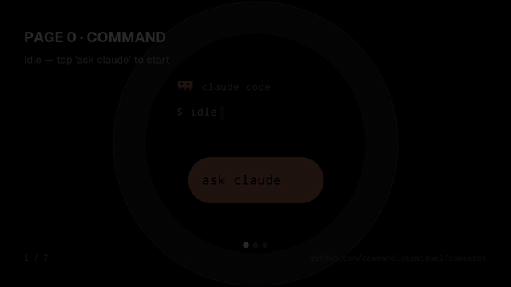
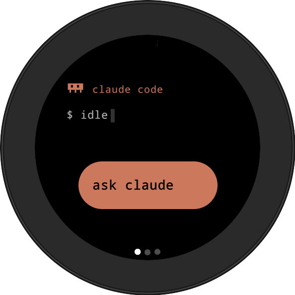
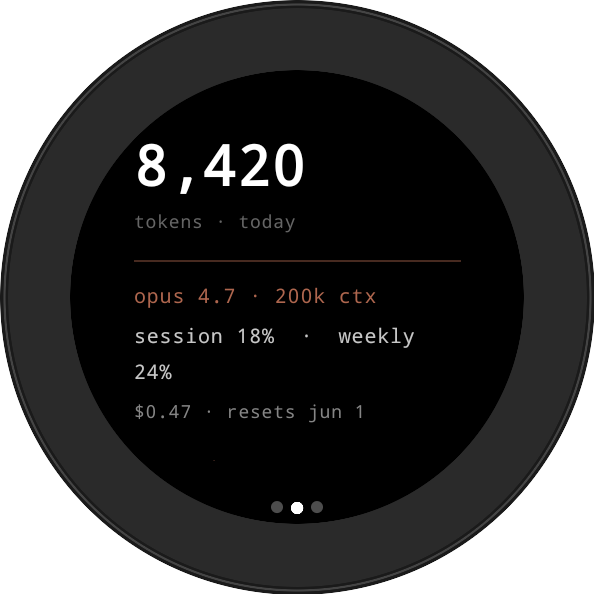
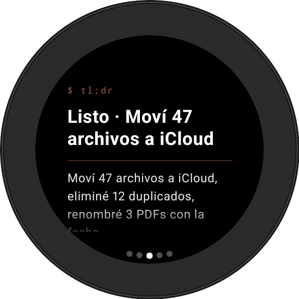
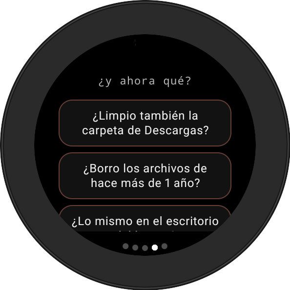
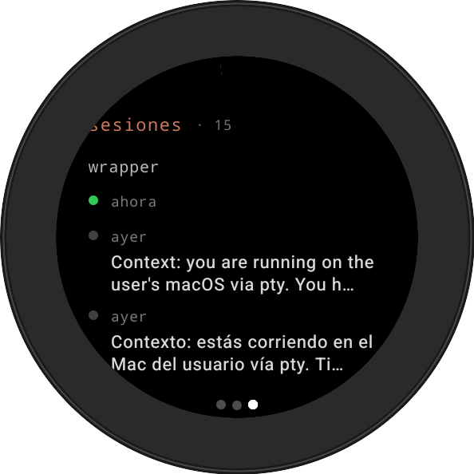
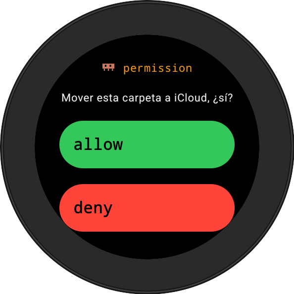
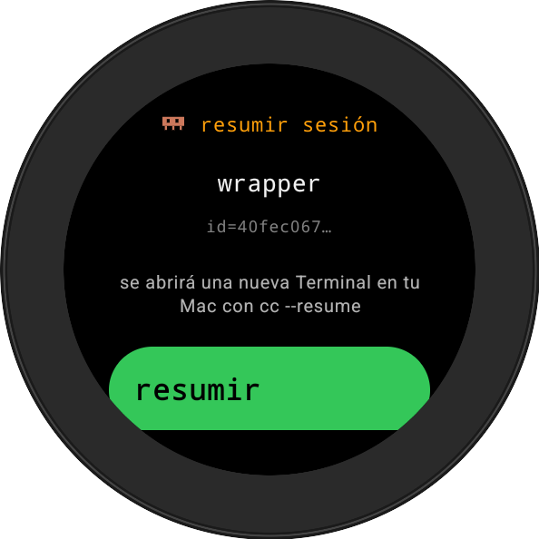

# CCWEAROS

**Stop alt-tabbing to approve Claude Code permissions. Tap your wrist.**

<p align="center">
  
</p>

<p align="center">
  <a href="LICENSE"></a>
  
  
  
</p>

A Wear OS app that bridges **Claude Code** on your Mac to your **Galaxy Watch 8**. Live status, voice prompts, tap-allow permissions, session resume — all relayed through a Firebase Realtime Database that's basically used as a message bus.

> If you've ever wished you could approve Claude Code's permission prompts without context-switching back to your terminal, this is that.

---

## Why this exists

Three things you can't do in a terminal that become trivial on a watch:

- **Approve permissions without alt-tabbing.** Claude Code stops every time it wants to touch a file, hit a URL, run a shell command. The watch buzzes, you tap allow, Claude continues. No window switch.
- **Voice-prompt from anywhere.** _(while your Mac is awake.)_ Walking, in line at the bank, between sets at the gym, waiting at the doctor. _"Claude, organize the screenshots from yesterday."_ Your Mac at home does it.
- **Glance at progress.** Live tokens, current model, monthly cost, the whimsical activity verb (`✻ Razzmatazzing…`) — all on a 1.3" round display. No browser tab needed.

### Honest constraints, upfront

- **Your Mac must be awake** for any of this to work. There's no cloud relay. Mac asleep / off → watch shows OFFLINE.
- **Voice mode (daemon) runs `claude -p` non-interactively**, which auto-allows tool use during that run. For permission-gated work, run in **interactive mode** (`npm start`) or use the `cc` alias.
- **Tested only on macOS + Wear OS 4+ (Galaxy Watch 8 specifically).** Pixel Watch, Apple Watch and Linux/Windows are out of scope for v0.1.0.

When a task completes, the watch vibrates and **auto-navigates** to the response page (smart guard: only if you're on Command or Metrics — never interrupts you when you're reading Sessions).

---

## The 5 pages

The watch UI is a horizontal pager. Pages hide themselves when their data is empty.

| #   | Page          | Screenshot                                                    | What you see                                                                                                                                                                                          |
| --- | ------------- | ------------------------------------------------------------- | ----------------------------------------------------------------------------------------------------------------------------------------------------------------------------------------------------- |
| 0   | **Command**   |    | Status (`$ idle` / `$ running` / `$ awaiting permission`), activity verb (`✻ Crunching…`), current task, and the big CTA: `ask claude` when fresh, `continuar` mid-thread, `✗ detener` while running. |
| 1   | **Metrics**   |    | Tokens today, model + context window, session / weekly / monthly percentages, current monthly cost, reset times.                                                                                      |
| 2   | **Response**  |   | Claude's last answer. Adaptive headline, scrollable body with inline markdown, scroll-position bar on the right. Auto-target of the post-completion haptic + nav.                                     |
| 3   | **Followups** |  | 2–3 tappable chips with Claude's suggested next prompts (bilingual fallback if Claude omitted them) + `↻ nueva conversación` reset button.                                                            |
| 4   | **Sessions**  |   | Recent Claude Code sessions on your Mac, grouped by project, sorted newest-first. Tap any non-active row → confirm → daemon opens that session in a new Terminal window with full context loaded.     |

Plus an **overlay** that takes over the entire screen when Claude asks for permission:

<p align="center">
  
  
</p>

> Long-press the `✗ detener` button on Page 0 (while a task is running) to force-reset UI state when the wrapper looks dead — writes `IDLE` directly to RTDB so you're not stuck in phantom-RUNNING.

---

## Architecture

```
   ┌──────────────────┐        ┌────────────┐        ┌────────────────┐
   │  Galaxy Watch 8  │ ◀────▶ │  Firebase  │ ◀────▶ │  macOS daemon  │
   │  (Wear OS, Kt)   │  RTDB  │  Realtime  │  Admin │  (Node + TS)   │
   └──────────────────┘        └────────────┘        └────────┬───────┘
                                                              │
                                                       pty / claude -p
                                                              │
                                                              ▼
                                                     ┌────────────────┐
                                                     │  Claude Code   │
                                                     │      CLI       │
                                                     └────────────────┘
```

Two wrapper modes share the same RTDB schema and the same watch UI:

- **Interactive** (`npm start`) — spawns Claude in a pseudo-TTY, you use Claude in your terminal as usual. The wrapper mirrors stdout AND parses tokens / activity / permission / status. Watch shows what's happening; tap Allow/Deny on watch instead of typing in terminal.
- **Daemon** (`CCWEAROS_MODE=daemon`, auto-started by a macOS LaunchAgent) — runs in background forever. Listens for prompts from the watch on `/prompt`. When a prompt arrives, runs `claude -p <text> --output-format=stream-json --verbose`, parses the JSON event stream, streams the answer + tokens + model info back to the watch.

There's also a **mid-session bridge** (`/ccwearos` slash command + PreToolUse hook) for when you started Claude normally and only now decide to bridge to the watch.

For RTDB paths and writer/reader contracts, see [`CLAUDE.md`](CLAUDE.md#firebase-rtdb-schema). For sprint-by-sprint history, see [`docs/CHANGELOG.md`](docs/CHANGELOG.md).

---

## Setup

### Prerequisites

- macOS (the wrapper runs there)
- [Claude Code](https://docs.claude.com/en/docs/claude-code/overview) installed (`claude --version` works)
- Free [Firebase](https://console.firebase.google.com) account
- [Android Studio](https://developer.android.com/studio) + JDK 17+ (Studio includes a bundled JDK; if you also want one on PATH: `brew install openjdk@21`)
- A Wear OS API 30+ emulator OR a real Wear OS 4+ watch

### 1 — Firebase project

1. Console → **Add project** → name it whatever you want
2. **Realtime Database** → **Create Database** → any region → start in Locked mode
3. **Authentication** → **Sign-in method** → enable **Anonymous**
4. **Project settings** → **Service accounts** → **Generate new private key** → save the JSON locally (Admin SDK key — **do not commit**)
5. **Project settings** → register an Android app with package `com.caamano.ccwearos` (or whatever you renamed it to) → download `google-services.json` → drop at `watch/app/google-services.json`

### 2 — Wrapper

```bash
cd wrapper
npm install
mkdir -p secrets && mv ~/Downloads/<project>-firebase-adminsdk-*.json secrets/firebase-admin-key.json
cp .env.example .env
# Edit .env: set FIREBASE_DB_URL to your Realtime DB URL
npm run verify   # smoke test: writes /status=IDLE, reads it back
```

### 3 — Watch (emulator first)

```bash
cd ../watch
./gradlew assembleDebug
adb install -r app/build/outputs/apk/debug/app-debug.apk
adb shell am start -n com.caamano.ccwearos/.presentation.MainActivity
```

First launch you see `$ offline` (daemon isn't running yet — next step).

### 4 — Pin Firebase rules to your watch's UID

```bash
adb logcat -d | grep "Notifying id token"
# → user ( <UID> )
```

Open `firebase-rules.json`, replace `EMULATOR_UID_HERE` with that UID. Paste the JSON into Firebase Console → Realtime Database → Rules → **Publish**.

### 5 — Daemon (auto-start at login)

```bash
bash scripts/install-launchagent.sh
tail -f ~/Library/Logs/ccwearos.log
# Expect: [ccwearos] Daemon online. DB: ...
```

To stop / uninstall: `bash scripts/install-launchagent.sh stop` or `… uninstall`.

### 6 — Try the voice flow

No mic on the emulator? Simulate:

```bash
cd wrapper
npx tsx scripts/send-prompt.ts "explain this project in one sentence"
```

On a real watch with a mic, tap **ask claude**, allow the mic permission once, speak. You should see the watch flip to `$ running`, the answer stream into Page 2, watch vibrate and auto-navigate when done.

---

## Deploying to a real Galaxy Watch 8

1. **Watch: enable Developer Mode** — Settings → About watch → Software → tap "Software version" 7 times.
2. **Watch: enable Wireless Debugging** — Settings → Developer options → toggle **ADB debugging** + **Debug over Wi-Fi** ON.
3. **Watch: pair** — In Wireless debugging, tap "Pair new device". Note the IP, port, and 6-digit code.
4. **Mac: pair + connect**:
   ```bash
   adb pair <IP>:<PAIRING_PORT> <CODE>
   adb connect <IP>:<CONNECTION_PORT>   # second port on the main wireless-debug screen
   ```
5. **Mac: install + launch**:
   ```bash
   adb -s <IP>:<CONNECTION_PORT> install -r watch/app/build/outputs/apk/debug/app-debug.apk
   adb -s <IP>:<CONNECTION_PORT> shell am start -n com.caamano.ccwearos/.presentation.MainActivity
   ```
6. **Capture the watch's UID** from logcat and add to `firebase-rules.json` as the second allowed UID. Republish.
7. **Grant mic permission** the first time you tap "ask claude" — Wear OS will prompt.

---

## Design choices worth knowing about

A reading list for anyone hacking on this. Full debugging stories live in [`docs/CHANGELOG.md`](docs/CHANGELOG.md).

**`node-pty` spawn-helper +x bit.** npm installs node-pty with a `prebuilds/<arch>/spawn-helper` binary, but the install loses its executable bit. Every `posix_spawnp` fails with no useful error. Fix: a postinstall script that runs `chmod +x` on it — see `wrapper/package.json`.

**`/bin/sh -c 'exec claude'` wrapper.** node-pty's `posix_spawnp` doesn't handle some Bun-compiled binaries (Claude Code is one). Spawning `sh` and letting it `exec` the target works around it cleanly.

**Server timestamps everywhere.** Wear OS emulators drift hours behind real-world time. `System.currentTimeMillis()` from the watch made every command look stale to the wrapper's age check. Switching to Firebase's `ServerValue.TIMESTAMP` makes the bug impossible.

**Stream-json over TUI parsing.** Daemon mode uses `claude -p --output-format=stream-json --verbose`, which gives structured events with `model`, `total_cost_usd`, `usage.input_tokens`, `modelUsage[].contextWindow`, `rate_limit_event.resetsAt`. Way more reliable than parsing the interactive TUI.

**`AnimatedContent` needs a `contentKey` for status flips.** The watch's top-level `AnimatedContent` switches between `PermissionScreen` / `OfflineScreen` / `DashboardScreen` based on status. If you key it on `status` directly, every `RUNNING ↔ IDLE` flip (i.e., every task completion) re-creates the dashboard composable — `rememberPagerState` resets to page 0 and any `LaunchedEffect` subscribers (notably the `SharedFlow` driving the task-completion haptic + auto-nav) get cancelled mid-emission. Pass a `contentKey` lambda that collapses dashboard-eligible statuses under a single key so the dashboard persists.

**Reset critical flags BEFORE awaits in `finally`.** The wrapper's voice-run finally clears six pieces of state in sequence; the `busy = false` reset used to sit at the bottom. A transient Firebase OAuth token-refresh failure could throw on any of the earlier awaits, exit the finally early and leave `busy = true` forever — every subsequent voice prompt then dropped silently as "Busy" until daemon restart. Put the flag reset first; wrap the rest in its own try/catch.

---

## Limitations

- The wrapper has to run on your Mac. If the Mac is off, the watch shows OFFLINE — there's no cloud relay.
- Daemon mode (voice flow) uses `claude -p`, which is non-interactive; Claude auto-allows tool use during these runs. For permission-gated work, run interactive mode (`npm start`) or use the `cc` alias.
- Markdown rendering on the watch is inline-only (bold / italic / code). Block markdown renders as plain text.
- Tables get flattened to `cell · cell · cell` rows — multi-line table cells lose column structure.
- The watch and the Mac need to be on the same network for FCM wake-up to feel instant; cross-network it still works but with a small delay.

---

## Repo layout

```
wrapper/        # Node.js + TypeScript bridge (daemon + interactive modes)
watch/          # Wear OS / Jetpack Compose Material3 app
scripts/        # macOS LaunchAgent installer, env helper
docs/           # CHANGELOG.md (sprint history), screenshots/
firebase-rules.json   # RTDB security rules — pin to your watch's UID
CLAUDE.md       # Current-state reference (layout, schema, hard rules)
```

---

## Tech stack

- **Wrapper**: Node.js 22, TypeScript 5.6 strict, `firebase-admin` 13, `node-pty` 1.1, Vitest
- **Watch**: Kotlin 2.2, Wear Compose Material3 1.5, Firebase BOM 33.7, AGP 9.2, JDK 21
- **Infra**: Firebase Realtime Database, Firebase Cloud Messaging, macOS LaunchAgents

---

## License

MIT — see [`LICENSE`](LICENSE). Build whatever you want with it.

---

<p align="center">
  Built with <a href="https://www.anthropic.com/claude-code">Claude Code</a> on a Galaxy Watch 8.<br/>
  Issues, PRs, and weird use cases welcome.
</p>
